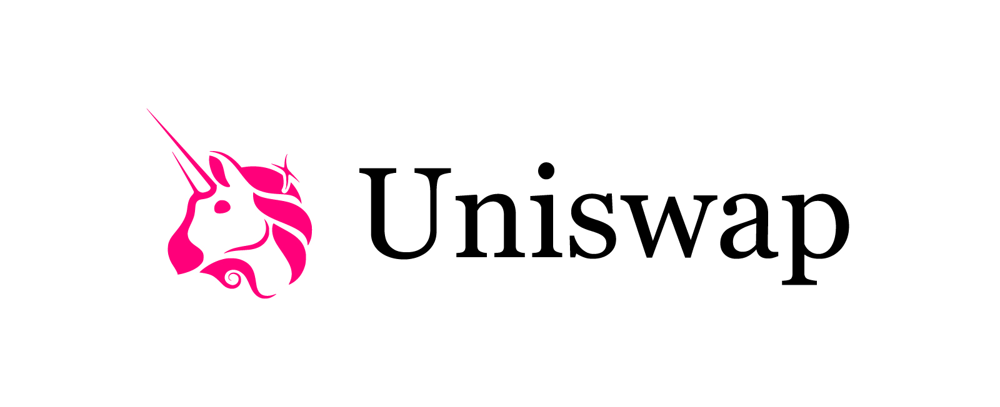

<a name="readme-top"></a>

[![Contributors][contributors-shield]][contributors-url]
[![Forks][forks-shield]][forks-url]
[![Stargazers][stars-shield]][stars-url]
[![Issues][issues-shield]][issues-url]
[![MIT License][license-shield]][license-url]
[![LinkedIn][linkedin-shield]][linkedin-url]

<!-- PROJECT LOGO -->
<br />
<div align="center">
  <a href="https://github.com/Aboudoc/Uniswap-v2.git">
    
  </a>

<h3 align="center">Uniswap V2</h3>

  <p align="center">
    Uniswap V2
    <br />
    <a href="https://github.com/Aboudoc/Uniswap-v2"><strong>Explore the docs »</strong></a>
    <br />
    <br />
    <a href="https://github.com/Aboudoc/Uniswap-v2">View Demo</a>
    ·
    <a href="https://github.com/Aboudoc/Uniswap-v2/issues">Report Bug</a>
    ·
    <a href="https://github.com/Aboudoc/Uniswap-v2/issues">Request Feature</a>
  </p>
</div>

<!-- TABLE OF CONTENTS -->
<details>
  <summary>Table of Contents</summary>
  <ol>
    <li>
      <a href="#about-the-project">About The Project</a>
      <ul>
        <li><a href="#built-with">Built With</a></li>
      </ul>
    </li>
    <li>
      <a href="#getting-started">Getting Started</a>
      <ul>
        <li><a href="#prerequisites">Prerequisites</a></li>
        <li><a href="#installation">Installation</a></li>
      </ul>
    </li>
    <li><a href="#usage">Usage</a></li>
    <li><a href="#Uniswap-v2">Constant Product AMM</a></li>
    <li><a href="#Time-Weighted-Average-Price">Time Weighted Average Price</a></li>
    <li><a href="#Uniswap-V2-Price-Oracle">Uniswap V2 Price Oracle</a></li>
    <li><a href="#Uniswap-v2-Spot-Price-Examples">Constant Product AMM Spot Price Examples</a></li>
    <li><a href="#Uniswap-V3-Price-Oracle">Uniswap V3 Price Oracle</a></li>
    <li><a href="#Geometric-Mean">Geometric Mean</a></li>
    <li><a href="#Uniswap-V3-TWAP-and-Geometric-Mean">Uniswap V3 TWAP and Geometric Mean</a></li>
    <li><a href="#Uniswap-V3-TWAP-Inverse-Price">Uniswap V3 TWAP Inverse Price</a></li>
    <li><a href="#roadmap">Roadmap</a></li>
    <li><a href="#contributing">Contributing</a></li>
    <li><a href="#license">License</a></li>
    <li><a href="#contact">Contact</a></li>
    <li><a href="#acknowledgments">Acknowledgments</a></li>
  </ol>
</details>

<!-- ABOUT THE PROJECT -->

## About The Project

This project shows how to interact with the main functions of Uniswap V2

<p align="right">(<a href="#readme-top">back to top</a>)</p>

### Built With

- [![Hardhat][Hardhat]][Hardhat-url]
- [![Ethers][Ethers.js]][Ethers-url]

<p align="right">(<a href="#readme-top">back to top</a>)</p>

<!-- GETTING STARTED -->

## Getting Started

To get a local copy up and running follow these simple example steps.

### Prerequisites

- npm

  ```sh
  npm install npm@latest -g
  ```

- hardhat

  ```sh
  npm install --save-dev hardhat
  ```

  ```sh
  npm install @nomiclabs/hardhat-ethers @nomiclabs/hardhat-waffle
  ```

  run:

  ```sh
  npx hardhat
  ```

  verify:

  ```sh
  npx hardhat verify --network goerli "contract address" "pair address"
  ```

### Installation

1. Clone the repo
   ```sh
   git clone https://github.com/Aboudoc/Uniswap-v2.git
   ```
2. Install NPM packages
   ```sh
   npm install
   ```
3. Dependencies

   ```sh
   npm i @uniswap/v2-core @uniswap/v2-periphery
   ```

<p align="right">(<a href="#readme-top">back to top</a>)</p>

<!-- USAGE EXAMPLES -->

## Usage

If you need testnet funds, use the [Alchemy testnet faucet](https://goerlifaucet.com/).

**This project shows how to swap, add and remove liquidity**

## Constant Product AMM

Uniswap V2 is a Constant product AMM (automated market maker) <=> a decentralized exchange where 2 tokens are traded.
You can find an indeep review of CPAMM is [this repo](https://github.com/Aboudoc/Uniswap-v2)

## Uniswap V2 Single Hop Swap

This challenge introduces 2 functions to swap tokens on Uniswap V2

`swapExactTokensForTokens` - Sell all of input token.
`swapTokensForExactTokens` - Buy specific amount of output token.

### State variables

1.
2.
3.

### Function swapSingleHopExactAmountIn

1.
2.
3.
4.

### Function swapSingleHopExactAmountOut

### Forking mainnet

1. Setup hardhat.config
2. Find a whale on etherscan

`hardhat.config.js`

```sh
  networks: {
        hardhat: {
          forking: {
            url: `https://eth-mainnet.alchemyapi.io/v2/${process.env.ALCHEMY_API_KEY}`,
       },
     },
  }
```

`.env`

```sh
ALCHEMY_API_KEY=...
```

`terminal1`

```sh
ALCHEMY_API_KEY=...
npx hardhat node --fork https://eth-mainnet.g.alchemy.com/v2/$ALCHEMY_API_KEY
```

`terminal2`

```sh
npx hardhat test --network localhost
```

<p align="right">(<a href="#readme-top">back to top</a>)</p>

<p align="right">(<a href="#readme-top">back to top</a>)</p>

## Uniswap V2 Multi Hop Swap

<p align="right">(<a href="#readme-top">back to top</a>)</p>

## Uniswap V2 Add and Remove Liquidity

<p align="right">(<a href="#readme-top">back to top</a>)</p>

## Uniswap V2 Flash Swap

<p align="right">(<a href="#readme-top">back to top</a>)</p>

## Note

This contract assumes that token0 and token1 both have same decimals

Consider fees = 3%

### Further reading

(...soon)

### Sources

<p align="right">(<a href="#readme-top">back to top</a>)</p>

<!-- ROADMAP -->

## Roadmap

- [ ] Uniswap V3 TWAP
- [ ] Further reading
- [ ] Deploy script
- [ ] Unit test

See the [open issues](https://github.com/Aboudoc/Uniswap-v2.git/issues) for a full list of proposed features (and known issues).

<p align="right">(<a href="#readme-top">back to top</a>)</p>

<!-- CONTRIBUTING -->

## Contributing

Contributions are what make the open source community such an amazing place to learn, inspire, and create. Any contributions you make are **greatly appreciated**.

If you have a suggestion that would make this better, please fork the repo and create a pull request. You can also simply open an issue with the tag "enhancement".
Don't forget to give the project a star! Thanks again!

1. Fork the Project
2. Create your Feature Branch (`git checkout -b feature/AmazingFeature`)
3. Commit your Changes (`git commit -m 'Add some AmazingFeature'`)
4. Push to the Branch (`git push origin feature/AmazingFeature`)
5. Open a Pull Request

<p align="right">(<a href="#readme-top">back to top</a>)</p>

<!-- LICENSE -->

## License

Distributed under the MIT License. See `LICENSE.txt` for more information.

<p align="right">(<a href="#readme-top">back to top</a>)</p>

<!-- CONTACT -->

## Contact

Reda Aboutika - [@twitter](https://twitter.com/AboutikaR) - reda.aboutika@gmail.com

Project Link: [https://github.com/Aboudoc/Uniswap-v2.git](https://github.com/Aboudoc/Uniswap-v2.git)

<p align="right">(<a href="#readme-top">back to top</a>)</p>

<!-- ACKNOWLEDGMENTS -->

## Acknowledgments

- [Smart Contract Engineer](https://www.smartcontract.engineer/)

<p align="right">(<a href="#readme-top">back to top</a>)</p>

<!-- MARKDOWN LINKS & IMAGES -->
<!-- https://www.markdownguide.org/basic-syntax/#reference-style-links -->

[contributors-shield]: https://img.shields.io/github/contributors/Aboudoc/Uniswap-v2.svg?style=for-the-badge
[contributors-url]: https://github.com/Aboudoc/Uniswap-v2/graphs/contributors
[forks-shield]: https://img.shields.io/github/forks/Aboudoc/Uniswap-v2.svg?style=for-the-badge
[forks-url]: https://github.com/Aboudoc/Uniswap-v2/network/members
[stars-shield]: https://img.shields.io/github/stars/Aboudoc/Uniswap-v2.svg?style=for-the-badge
[stars-url]: https://github.com/Aboudoc/Uniswap-v2/stargazers
[issues-shield]: https://img.shields.io/github/issues/Aboudoc/Uniswap-v2.svg?style=for-the-badge
[issues-url]: https://github.com/Aboudoc/Uniswap-v2/issues
[license-shield]: https://img.shields.io/github/license/Aboudoc/Uniswap-v2.svg?style=for-the-badge
[license-url]: https://github.com/Aboudoc/Uniswap-v2/blob/master/LICENSE.txt
[linkedin-shield]: https://img.shields.io/badge/-LinkedIn-black.svg?style=for-the-badge&logo=linkedin&colorB=555
[linkedin-url]: https://www.linkedin.com/in/r%C3%A9da-aboutika-34305453/?originalSubdomain=fr
[product-screenshot]: https://ethereum.org/static/28214bb68eb5445dcb063a72535bc90c/9019e/hero.webp
[Hardhat]: https://img.shields.io/badge/Hardhat-20232A?style=for-the-badge&logo=hardhat&logoColor=61DAFB
[Hardhat-url]: https://hardhat.org/
[Ethers.js]: https://img.shields.io/badge/ethers.js-000000?style=for-the-badge&logo=ethersdotjs&logoColor=white
[Ethers-url]: https://docs.ethers.org/v5/
[Vue.js]: https://img.shields.io/badge/Vue.js-35495E?style=for-the-badge&logo=vuedotjs&logoColor=4FC08D
[Vue-url]: https://vuejs.org/
[Angular.io]: https://img.shields.io/badge/Angular-DD0031?style=for-the-badge&logo=angular&logoColor=white
[Angular-url]: https://angular.io/
[Svelte.dev]: https://img.shields.io/badge/Svelte-4A4A55?style=for-the-badge&logo=svelte&logoColor=FF3E00
[Svelte-url]: https://svelte.dev/
[Laravel.com]: https://img.shields.io/badge/Laravel-FF2D20?style=for-the-badge&logo=laravel&logoColor=white
[Laravel-url]: https://laravel.com
[Bootstrap.com]: https://img.shields.io/badge/Bootstrap-563D7C?style=for-the-badge&logo=bootstrap&logoColor=white
[Bootstrap-url]: https://getbootstrap.com
[JQuery.com]: https://img.shields.io/badge/jQuery-0769AD?style=for-the-badge&logo=jquery&logoColor=white
[JQuery-url]: https://jquery.com

```

```
